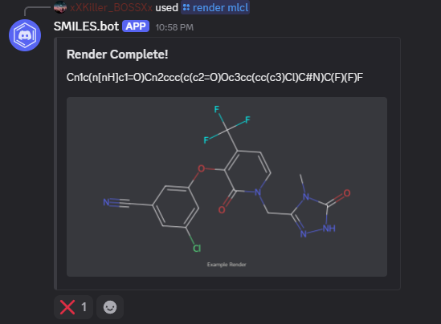
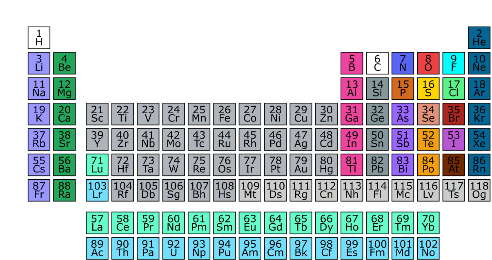

# SMILES.bot

A Discord bot for rendering chemical structures and equations using SMILES notation.

## Table of Contents
- [Getting Started](#getting-started)
- [Features](#features)
  - [Help Menu](#help-menu)
  - [Render](#render)
    - [ID Conversion](#id-conversion)
    - [Rendering Examples](#rendering-examples)
  - [Extra Features](#extra-features)
  - [Customization](#customization-commands)
    - [Default Render Color Palettes](#default-render-color-palettes)
- [SMILES Guide](#smiles-guide)
  - [Bonds](#bonds)
  - [Branching](#branching)
  - [Stereochemistry](#stereochemistry)
  - [Isotopes and Charges](#isotopes-and-charges)
- [Contributing](#contributing)
- [Legal](#legal)

## Getting Started
Click the link to invite the bot to your server [Invite SMILES.bot](https://discord.com/oauth2/authorize?client_id=1347275416225976333&permissions=0&integration_type=0&scope=bot).

# Features
## Help Menu
### `/help`
Displays the help menu.

### `/smileshelp`
Quick guide to SMILES syntax.

## Render
### `/render mlcl:<SMILES Notation>`
**Render chemical structures using SMILES syntax.**
- Render multiple structures by separating them with a `;` (up to 4 structures).
- Add legends under the render image using `legend:<text>`. Multiple legends can be added by separating them with a `;` (up to 4 legends).

#### ID Conversion
This render function also supports:
- IUPAC Names
- Common Names
- CAS Numbers
- InChIKey

#### Rendering Examples
##### Single compound

`/render mlcl:CC(=O)O`

##### Multiple compounds

`/render mlcl mlcl: OCCc1ccn2cnccc12; C1CC1Oc1cc2ccncn2c1; CNC(=O)c1nccc2cccn12`

##### ID conversion in use

`/render mlcl:Acetaminophen`

## Extra Features
### `/info <element>`
Get information about an element. For example, to get information about Carbon, use: `/info element:6`
### `/auto_smile`
Enable or disable automatic `&SMILES Notation&` message detection.
### `/clear`
Restore all settings and customizations for the server back to default.

## Customization Commands

| Command                  | Description                                                                 |
|--------------------------|-----------------------------------------------------------------------------|
| `/set prefix`            | Set a custom prefix for your server.                                       |
| `/set color <element> <color>`   | Change the render color of an element. Example: `element:6 color:255,0,0`. |
| `/set bgcolor <color>`   | Set the render background color. Example: `255,255,255`.                   |
| `/get prefix`            | Get the current prefix.                                                   |
| `/get color <element>`   | Get the render color of a specific element.                                |
| `/get bgcolor`           | Get the current render background color.                                  |

### Default Render Color Palettes

# SMILES Guide
SMILES (short for Simplified Molecular Input Line Entry System) is a line notation used by chemists to describe the structure of chemical compounds. Below is a quick guide into the basic syntax for SMILES Notation.
## Bonds
` . ` Disconnected structures such as ionic bonds and multiple compounds in an image.\
` - `Single bonds (optional/usually omitted).\
` = ` Double bonds.\
` # ` Tripple bonds.\
` $ ` Quadruple bonds.\
` : ` Aromatic 'one and a half' bonds.\
` / ` Single bond (directional) use for cis-trans stereochemistry.\
` \ ` Single bond (directional) use for cis-trans stereochemistry.
## Branching
`( ) `are used to denote branches, for example Isopropyl Alcohol is `CC(O)C`. Bond type is put inside the parentheses like `CCC(=O)O`.
## Stereochemistry
` / and \ `are used for cis-trans stereochemistry, for example (E)-1,2-Dichloroethene is `Cl/C=C/Cl`. \
` @ and @@ ` are used to denote S (`@`) and R (`@@`) stereocenters.
## Isotopes and charges
` [ and ] ` are used for charges and isotopes, for example Carbon-14 is [14C] and Sodium Chloride is `[Na+].[Cl-]`

# Contributing
If you would like to contribute to the project, please fork the repository and submit a pull request. We welcome contributions of all kinds, including bug fixes, new features, and documentation improvements.

# Legal
- **[License](./LICENSE)**: This project is licensed under the GNUv3.0 License.
- **[Privacy Policy](./PRIVACY.md)**: Read the privacy policy for details on how user data is handled.
- **[Terms of Service](./TERMS.md)**: Review the terms of service for using SMILES.bot.

---
